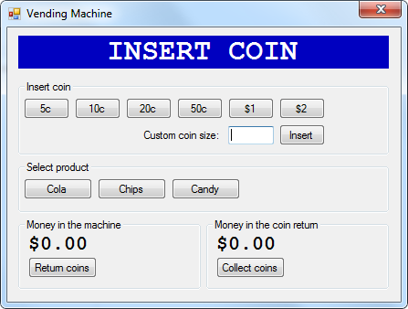

# VendingMachineSimulator
My solution to the vending machine simulator tech test for Ticket Arena / Event Genius

## Assumptions
* the only coins accepted are 5c, 10c, 20c, 50c, $1 and $2. I've used pound sterling values because I'm from the UK, but currencies are displayed in US dollars (as per the spec)
* coins can be identified by their "size" which is unique for each coin. I've used an arbitrary number which is the cent value multiplied by 100, eg the 50c coin has a "size" of 50, $1 is 100 etc. This allows for easier testing. In a real machine, coins would be identified by multiple properties, such as their diameter, thickness, mass etc.
* there are three products available: Cola costing $1, Chips costing $0.50 and Candy costing $0.65
* the machine does not run out of products and is always able to supply what the user requests
* the machine does not run out of coins and is always to supply change

## Prerequisites
* Visual Studio 2015
* .net framework 4.6.1
* an internet connection to download NuGet packages when the solution is built

## How to run the simulator
* clone the GitHub repository
* load the solution in Visual Studio and build it
* set the VendingMachine.WindowsApp as startup project and run it

## How to use the simulator

* The box with a blue background and white text represents the vending machine's display
* Press one of the "Insert coin" buttons to insert a coin of the relevant amount. The "Custom coin size" text box can be used to specify an abitrary sized coin to insert.
* Press one of the "Select product" buttons to select a desired product
* the "Money in the machine" and "Money in the coin return" show the amount of money inserted, and the money remaining in the coin return (which has not been collected)
* The "Return coins" button moves the money in the machine into the coin return
* The "Collect coins" button collects the money in the coin return

## Enhancements for the future
* the machine could keep a count of each product it contains
* the coins inserted could be diverted into separate internal "bins", one bin per coin type accepted. A count could be kept of the number of the number of coins in each bin and when a bin is empty, change will be made by supplying more of a lower valued coin (if available)
* when either of the counts is low, an alert could be sent for the machine to be refilled
* display "INVALID COIN" when the user inserts an unknown coin. This requires an additional unit test and a very small change to the code to implement. I didn't implement this feature as it wasn't in the spec
* the list of products and their prices should be configurable
* the valid coins and their values should be configurable
